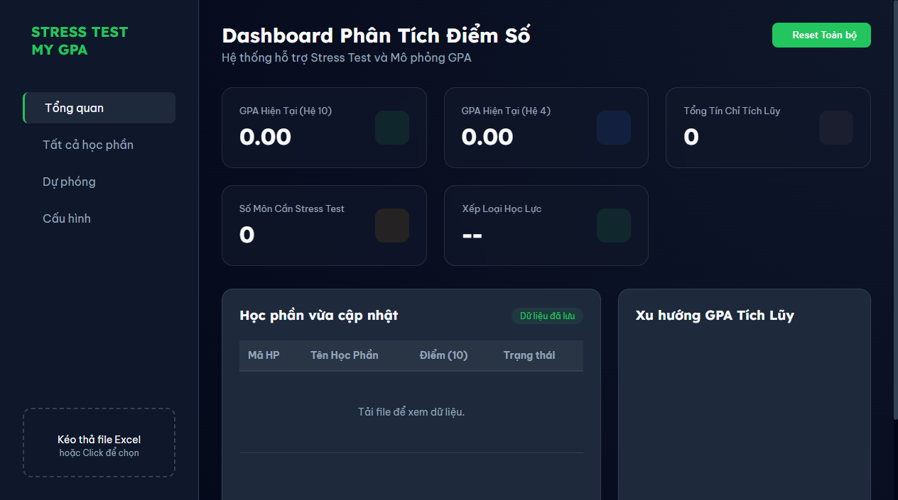

# 📊 STRESS TEST MY GPA 🚀

> **Đừng để GPA làm bạn Stress, hãy Stress Test lại nó!**

Bản điều khiển (Dashboard) phân tích điểm số đỉnh cao dành cho sinh viên, giúp bạn làm chủ lộ trình học tập, dự phóng tương lai và chinh phục mục tiêu GPA một cách thông minh nhất.

---

## ✨ Tại sao bạn cần STRESS TEST MY GPA?

Việc tính điểm tích lũy (GPA) và lên kế hoạch học tập thường rất đau đầu:
- **Ngại tính toán**: Phải tự tay nhập từng môn vào Excel.
- **Rối rắm**: Không biết môn nào được tính, môn nào ngoại lệ (GDTC, GDQP...).
- **Mơ hồ**: Muốn đạt GPA 3.6 thì mấy môn tới phải được bao nhiêu điểm?
- **Sợ sai**: Công thức tính GPA hệ 10 và hệ 4 dễ gây nhầm lẫn.

**STRESS TEST MY GPA** ra đời để giải quyết tất cả những điều đó chỉ trong **1 nốt nhạc**! 🎶

---

## 🚀 Tính năng nổi bật

### 📸 Xuất báo cáo cực nét
Chỉ với 1 click, bạn có ngay file ảnh PNG báo cáo GPA chuyên nghiệp để khoe bạn bè hoặc lưu lại làm mục tiêu phấn đấu.

### 🔮 Máy tính GPA Mục tiêu (Inverse Forecasting)
Bạn nhập con số mong muốn (VD: 3.2), hệ thống sẽ "vắt óc" tính toán xem bạn cần đạt bao nhiêu điểm ở các môn còn lại để đạt được con số đó. Không còn phải đoán mò!

### 📊 Trải nghiệm Glassmorphism hiện đại
Giao diện Dark-mode sang trọng, hiệu ứng kính mờ (Glassmorphism) tinh tế, mang lại cảm giác premium và alive trong từng cú click.

### 🎯 Đồng bộ hệ điểm 10 & 4
Tự động quy đổi và đồng bộ toàn bộ Dashboard theo hệ điểm bạn ưu thích. Hỗ trợ đầy đủ logic mapping của các trường đại học (UEH, v.v.).

### 🛡️ Xử lý môn đặc biệt thông minh
Tự động nhận diện và loại bỏ các môn Ngoại lệ, môn đạt (M/P) để đảm bảo số liệu GPA của bạn luôn chính xác tuyệt đối.

---

## 📝 Hướng dẫn sử dụng cho người mới (Non-tech)

Nếu bạn không phải dân lập trình, đừng lo! Hãy làm theo 3 bước cực đơn giản này:

### Bước 1: Tải công cụ về máy
1. Nhìn lên phía trên trang này, tìm nút màu xanh có chữ **[<> Code]**.
2. Click vào đó và chọn dòng cuối cùng: **Download ZIP**.
3. Sau khi tải về, hãy **Giải nén** tệp tin đó ra một thư mục trên máy tính của bạn.

### Bước 2: Chuẩn bị bảng điểm (Dành riêng cho sinh viên UEH)
Mặc dù công cụ hỗ trợ nhiều trường, nhưng nó được **tối ưu hóa hoàn hảo cho UEHer**:
1. Truy cập vào **Cổng thông tin sinh viên UEH** (student.ueh.edu.vn).
2. Vào mục: **Tra cứu thông tin** -> **Kết quả học tập**.
3. Chọn tất cả các năm học và nhấn nút **Xuất Excel**. Đây chính là file chúng ta cần!
   * *Lưu ý: Các bạn trường khác chỉ cần chuẩn bị file Excel có cột 'Mã học phần', 'Tên học phần', 'Số TC', 'Điểm' là có thể dùng được.*

### Bước 3: Khởi chạy
1. Tìm file có tên là `index.html` trong thư mục bạn vừa giải nén.
2. **Click đúp** để mở nó bằng trình duyệt (Chrome, Edge...) là bạn đã có ngay Dashboard để sử dụng!

---

## 🌐 Triển khai Online (GitHub Pages)

Nếu bạn là chủ Repo và muốn tạo link web chính thức:
1. Vào **Settings** -> **Pages**.
2. Chọn branch `main`, thư mục `/ (root)`.
3. Nhấn **Save**. Link web của bạn sẽ xuất hiện sau 1-2 phút!

---

## 🏗️ Công nghệ sử dụng

Dự án được xây dựng bằng tình yêu và những công nghệ hiện đại nhất (Client-side):
- **Core**: HTML5, CSS3 (Vanilla), JavaScript ES6+
- **Visualization**: [Chart.js](https://www.chartjs.org/)
- **Excel Engine**: [SheetJS](https://sheetjs.com/)
- **UI Assets**: [Lucide Icons](https://lucide.dev/), [html2canvas](https://html2canvas.hertzen.com/)

---

## 🙌 Đóng góp

Dự án phát triển bởi **[KiettranFNF002](https://github.com/KiettranFNF002)**. Mọi ý tưởng đóng góp hoặc báo lỗi, vui lòng tạo **Issue** hoặc **Pull Request** nhé!

---
⭐ **Nếu dự án này giúp bạn bớt Stress, hãy tặng mình 1 Star nhé!** ⭐
